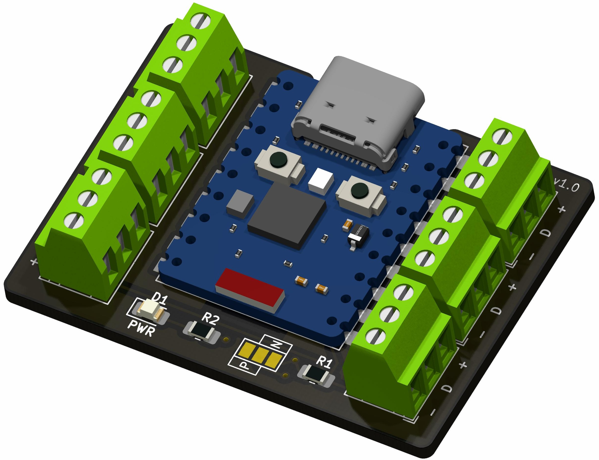
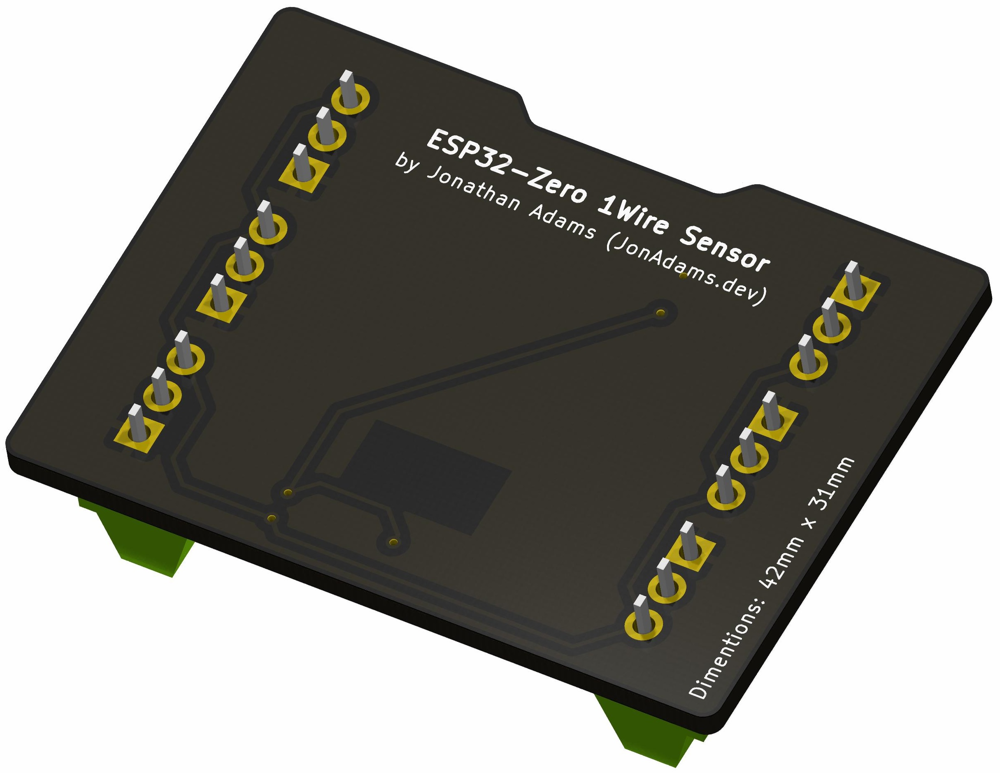
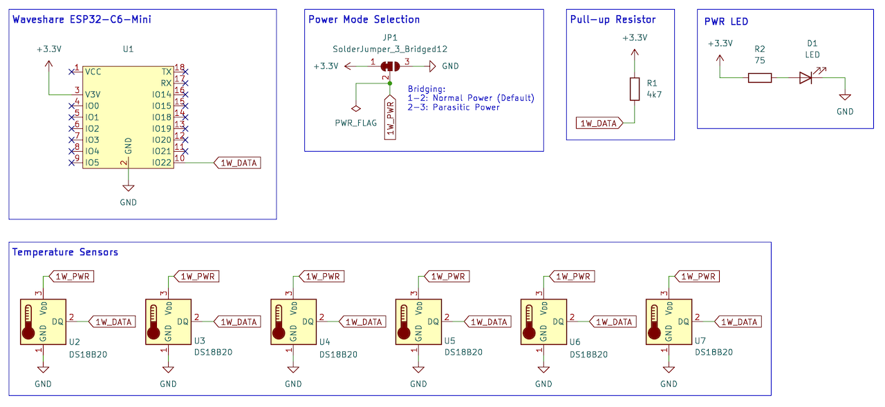

# ESP32-Zero 1-Wire Sensor

This PCB for is designed for use with the 'ESP32 Zero' boards such as [Waveshare ESP32-C6-Zero](https://www.waveshare.com/wiki/ESP32-C6-Zero) or [Waveshare ESP32-C3-Zero](https://www.waveshare.com/wiki/ESP32-C3-Zero) and 1-Wire sensors. You can hook up any 1-Wire sensors but it was primarialy designed to be used with Dallas DS18B20 temperature sensors.

   

## Features

- Footprint for soldering castelated EPS32-C6-Zero or ESP32-C3-Zero board
- 6x terminal block 1-Wire ports
- Mode select solder jumper for Normal/Paraside modes
- 42mm x 31mm borard

## Schematic

## Bill of Materials

| Ref   | Qty | Description/Value                    | Notes                          |
| ----- | --- | ------------------------------------ | ------------------------------ |
| U1    | 1   | ESP32-C3-Zero or ESP32-C6-Zero       |                                |
| U2-U7 | 6   | KF128 2.54mm Pitch 3P Screw Terminal |                                |
| R1    | 1   | 0805/2012 SMD Resistor (4.7k Ohm)    |                                |
| R2    | 1   | 0805/2012 SMD Resistor (75 Ohm)      | Check D1 LED Requirements      |
| D1    | 1   | 0805/2012 SMD LED                    | Check R2 Resistor Requirements |